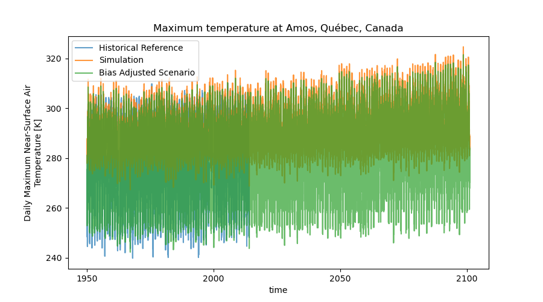

---

marp: true
theme: freud
_class: lead
class: default
footer: Building Open Climate Change Information Services in Python
header: PyCon Lithuania 2024
author: Trevor James Smith
paginate: true
backgroundColor: white
transition: fade
# backgroundImage: url('https://marp.app/assets/hero-background.svg')
size: 16:9
style: |
    footer {
      left: 5%;
      font-size: 20px;
      text-shadow: 0px 0px 10px #fff;
    }
    header {
      right: 10%;
      left: 60%;
      text-align: right;
      font-size: 20px;
      text-shadow: 0px 0px 10px #fff;
    }
    img[alt~="center"] {
      display: block;
      margin: 0 auto;
    }
    .container{
      display: flex;
    }
    .col{
      flex: 1;
    }

---

<style scoped>
  h1 {
    background-color: white;
    border-radius: 30px;
    font-size: 40px;
    left: 5%; 
    opacity: 90%;
    padding: 13px;
    position: absolute;
    right: auto;
  }
  li {
    background-color: white;
    border-radius: 30px;
    bottom: 10.5%;
    color: navy;
    font-size: 25px;
    list-style-type: none;
    opacity: 75%;
    padding: 10px;
    position: absolute;
    right: 5%;
    text-align: right;
  }
  header {
    background: 
      linear-gradient(orange, orange) top,
      linear-gradient(green, green) center,
      linear-gradient(red, red) bottom;
    background-size: 100% 33.33%;
    background-repeat: no-repeat;
    color: white;
    font-size: 30px;
    font-weight: bold;
    left: 35%;
    margin: auto;
    right: 35%;
    text-align: center;
  }
  footer{
    background: lightblue;
    color: black;
    font-size: 24px;
    left: 3%;
  }
  img[alt~="top-right"] {
    background-color: transparent;
    position: absolute;
    right: 3%;
    top: 3%;
    width: 225px;
  }
</style>

<!-- _footer: "**Ouranos**: Innovation cluster and consultation forum enabling Quebec society to better adapt to Climate Change" -->
<!-- _paginate: false -->

# Building Open Climate Change Information Services in Python

<!-- Thanks so much to PyCon Lithuania and the organizers for this fantastic conference so far. Today, I’m talking about how we've been using Python to build our open source offerings to better equip researchers interested in climate science. -->


- **Trevor James Smith**
**PyCon Lithuania**
**April 4th, 2024**
**Vilnius, Lithuania**

---

<style scoped>
    li {font-size: 26px;}
</style>

<!-- _footer: "Photo: Extratropropical Cyclone over Hudson Bay, Canada, August 2016. Credit: NASA Earth Observatory." -->


### Presentation Outline

<!-- This presentation is going to start by providing some context on climate adaptation information services, what my company has built with xclim and how we're actively making these kinds of analyses more accessible worldwide. -->

- Who am I? / What is Ouranos?
- What's our context?
- Climate Services?
- `xclim`: climate operations
- `finch`: `xclim` as a Service
- Climate WPS Frontends
- What's next for us?
- Acknowledgements

---

<style scoped>
  p {font-size: 26px;}
</style>

<!-- _footer: "" -->

<!-- So who am I? I'm a research software developer from Montréal, Québec. My background is in environmental science, specifically GIS and agroclimate modelling. I only really started picking up dev work on the job. I'm also learning Japanese for fun. -->


# Who am I?

**Trevor James Smith**

 [**github.com/Zeitsperre**](https://github.com/Zeitsperre)
 [**Zeit@techhub.social**](https://techhub.social/@zeit)

- Research software developer/maintainer from Montréal, Canada
- Studied climate change impacts on wine viticulture in Southern Québec
- Making stuff with Python for ~6.5 years
- 僕は日本語を勉強しています！

---


<style scoped>
  p {
    font-size: 18px;
    text-align: right;
  }
</style>

<!-- _header: "" -->
<!-- _footer: "" -->

<!-- My employer, Ouranos, is a not-for-profit based on Montréeal that works with the Canadian and Quebec governments on climate change adaptation. We were created in response to an extreme storm event that had 1.5 Million people without power for weeks and caused around 5.5 Billion dollars in damage. Our role is to connect government, industry, and academia with many types of climate information so that events like those are less impactful. For the past 8 years or so, we've been moving into software and research platform development. The core development team is small, but we do a lot of collaboration. -->


# What is [Ouranos](https://www.ouranos.ca/en)?

* Not-for-profit climate research consortium established in 2003 in Montréal, Québec, Canada
  * Created in response to the [January 1998 North American Ice Storm](https://en.wikipedia.org/wiki/January_1998_North_American_ice_storm)
* Climate change adaptation, climate modelling, and **climate information services**
* Regional Climate Model (RCM) Data Producer/Provider

Photo credit: https://www.communitystories.ca/v2/grand-verglas-saint-jean-sur-richelieu_ice-storm/

---

<style scoped>
  p {font-size: 20px;}
</style>

<!-- _header: "" -->
<!-- _footer: "" -->

<!-- Before we get to the Python, it would be good to talk about why climate researchers are becoming software developers;  The fact that human-induced Climate Change is occurring is established fact. The temperature change alone has the potential to really impact a lot of things we depend on. Extreme global weather patterns are just one such side effect. -->


# <!-- fit --> What's the **climate** situation?

*"Since systematic scientific assessments began in the 1970s, the influence of human activities on the warming of the climate system has evolved from theory to established fact"*

\- IPCC Sixth Assessment Report Technical Summary (IPCC AR6-TS)

- Climate Change is having major impacts on Earth's environmental systems
- IPCC: **Global average temperature has increased > 1.1 °C** over pre-industrial normals.
  - **> 1.5 °C** is seen as beyond a safe limit

---

<style scoped>
  footer {
    position: absolute;
    bottom: 3%;
    font-size: 15px;
  }
</style>

<!-- _footer: "Overpeck, Jonathan T., Gerald A. Meehl, Sandrine Bony, and David R. Easterling. “Climate Data Challenges in the 21st Century.” Science 331, no. 6018 (February 11, 2011): 700–702. https://doi.org/10.1126/science.1197869" -->

<!-- Since we only have one Earth to run experiments on, climate models are one tool to give us physically consistent estimates on what the future _could_ look like. Unfortunately, this means we need more and more storage and computation resources to test more hypotheses. At some point it becomes completely unmanageable and really challenging to even use it, so we need intermediaries to help. -->


# <!-- fit --> What's the **climate data** situation?

**Climate data is growing exponentially in size and complexity**
  * New climate models being developed every year
  * More climate simulations being produced every day
  * Higher resolution input **and** output datasets
  * Specialised analyses and more personalized user needs

---

<!-- _footer: "Infographic from [The Canadian Centre for Climate Services (CCCS)](https://www.canada.ca/en/environment-climate-change/services/climate-change/canadian-centre-climate-services/about.html) " -->

<!--  -->


# **Climate Services**

## What do they provide?

- Tailoring objectives and information to different user needs
- Providing access to **climate information**
- Building local mitigation/adaptation capacity
- Offering training and support
* Making sense of **Big** ***climate*** **Data**

---

<style scoped>
  li {
    font-size: 24px;
  }
</style>

<!-- -->

# What information do **Climate Services** provide?

<div class="container">

<div class="col">

**Climate indicators**, e.g.:
  - **Hot Days** (Days with temperature >= 22 deg Celsius);
  - **Beginning / End / Length of the growing season**;
  - **Average seasonal rainfall** (3-Month moving average precipitation);
  - **Daily temperature range**;
    - etc.

</div>

<div class="col">

**Planning tools**
  - Maps
  - Point estimates at geographic locations
  - Time series estimates
  - Gridded values
  - Raw data (for experts)
  * **Not really sure what they want/need?**
    **➔ Guidance from experts!**

</div>

</div>

---

<!--  -->

# Why build a **Climate Services** library in **Python**? 

* Robust and fast scientific Python libraries
* Growing demand for climate services/products
  - Provide access to the community so they can help themselves
* *The timing was right*
  - Internal and external demand for common tools
* Less time writing code, more time spent doing research

---

<!--  -->

# What are the requirements?

<div class="container">

<div class="col">

**What does it need to perform?**
  - **Climate Indicators**
    - Units management
    - Metadata management
  - **Ensemble statistics**;
  - **Bias Adjustment**;
  - **Data Quality Assurance Checks**

</div>

<div class="col">

**Implementation goals?**
  - **Operational** : Capable of handling very large ensembles of climate data
  - **Foolproof** : Automatic verification of data and metadata validity by default
  - **Extensible** : Flexibility of use and able to easily provide custom indicators, as needed

</div>

</div>

---

<!-- _header: "" -->

<!--  -->


# **Xclim** : Climate Services library

 [Ouranosinc/xclim](https://github.com/Ouranosinc/xclim)

- **Asynchonous IO** and **fast**
- **Open Source** design
- **standards-compliant** metadata
- **Extensible** (modular)
- **Operational**

---

<style scoped>
  h2{
    position: absolute;
    top: 7%;
  }
  li {
    position: absolute;
    bottom: 10%;
    font-size: 35px;
  }
</style>


## How did we build **Xclim**?

<div class="container">

<div class="col">

* **Data Structure**
<!-- We based our data structures on several Open Source scientific Python libraries, namely, Pandas, Numpy and Xarray, ensuring that our code can benefit from the parallelization provided by Dask. -->

</div>

<div class="col">

* **Algorithms**
<!-- Xclim was built to be an operational library and as such, we built our algorithms based on more conventional libraries such as scipy and statsmodels for statistics, scikit-learn for bias-adjustment. Numba provides Just-in-time compilation and -->

</div>

<div class="col">

* **Data and Metdata Conventions**
<!-- Units management and conventions are also key to ensuring that the outputs of operations can be easily used in other applications, and issues such as unit management are handled via libraries dedicated to ensuring that dimensions are always preserved and expected output units are always the same, regardless of inputs. -->

</div>

</div>

---

<!-- -->

## Upstream contributions from **Xclim**

- Non-standard calendar (`cftime`) support in `xarray.groupby`
- Quantile methods in `xarray.groupby`
- Non-standard calendar conversion migrated from `xclim` to `xarray`
- Climate and Forecasting (CF) unit definitions inspired from `MetPy`
  - Inspiring work in `cf-xarray`
- Weighted variance, standard deviations and quantiles in `xarray` (for ensemble statistics)
-  Faster **NaN**-aware quantiles in `numpy` 
-  Initial polyfit function in `xarray`
* Not to forget mentioning work done by the team in `xESMF`, `intake-esm`, `cf-xarray`, `xncml`, and others for `xclim`-related downstream tools and workflows

---

<!-- _header: "" -->

<!--  -->


## **Xclim** algorithm design

### Two ways of calculating indicators

* `indice` (**Core algorithms**)
  - For users that don't care for the standards and quality checks
* `indicators` (**End-User API**)
  - Metadata standards checks
  - Data quality checks
  - Time frequency checks
  - Missing data-compliance
  - Calendar-compliance

---

<!-- -->

## What does **Xclim** do? ➔ Units Management

```python
import xclim
from clisops.core import subset

# Data is in Kelvin, threshold is in Celsius, and other combinations

# Extract a single point location for the example
ds_pt = subset.subset_gridpoint(ds, lon=-73, lat=44)

# Calculate indicators with different units

# Kelvin and Celsius
out1 = xclim.atmos.growing_degree_days(tas=ds_pt.tas, thresh="5 degC", freq="MS")

# Fahrenheit and Celsius
out2 = xclim.atmos.growing_degree_days(tas=ds_pt.tas_F, thresh="5 degC", freq="MS")

# Fahrenheit and Kelvin
out3 = xclim.atmos.growing_degree_days(tas=ds_pt.tas_F, thresh="278.15 K", freq="MS")
```

---

<style scoped>
  img {
    position: absolute;
    box-shadow: 0px 0px 10px rgba(0, 0, 0, 0.5);
    left: 8%;
    size: 90%;
  }
</style>

<!-- -->

## What does **Xclim** do? ➔ Units Management


```python
import xclim

# Data is in Kelvin, threshold is in Celsius, and other combinations

# Extract a single point location for the example
ds_pt = subset.subset_gridpoint(ds, lon=-73, lat=44)

# Calculate indicators with different units

# Kelvin and Celsius
out1 = xclim.atmos.growing_degree_days(tas=ds_pt.tas, thresh="5 degC", freq="MS")

# Fahrenheit and Celsius
out2 = xclim.atmos.growing_degree_days(tas=ds_pt.tas_F, thresh="5 degC", freq="MS")

# Fahrenheit and Kelvin
out3 = xclim.atmos.growing_degree_days(tas=ds_pt.tas_F, thresh="278.15 K", freq="MS")
```

---

## What does **Xclim** do? ➔ Metadata Locales

<!-- `xclim` also has the ability to  -->

```python
import xarray as xr
import xclim


ds = xr.open_dataset("my_dataset.nc")

with xclim.set_options(
    # Drop timesteps with more than 5% of missing data
    set_missing="pct", missing_options=dict(pct={"tolerance": 0.05}),

    metadata_locales=["fr"] # Add French language metadata
):
    # Calculate Annual Frost Days (days with min temperature < 0 °C) 
    FD = xclim.atmos.frost_days(ds.tas, freq="YS")
```

---

<style scoped>
  img {
    box-shadow: 0px 0px 10px rgba(0, 0, 0, 0.5);
    left: 15%;
    position: absolute;
    top: 20%;
    width: 70%;
  }
</style>

<!-- -->

## What does **Xclim** do? ➔ Metadata Locales


```python
import xarray as xr
import xclim


ds = xr.open_dataset("my_dataset.nc")

with xclim.set_options(
    # Drop timesteps with more than 5% of missing data
    set_missing="pct", missing_options=dict(pct={"tolerance": 0.05}),

    metadata_locales=["fr"] # Add French language metadata
):
    # Calculate Annual Frost Days (days with min temperature < 0 °C) 
    FD = aclim.atmos.frost_days(ds.tas, freq="YS")
```

---

<style scoped>
  h2 {
    position: absolute;
    top: 10%;
  }
  p {
    bottom: 8%;
    position: absolute;
  }
</style>


## What does **Xclim** do ➔ Climate Ensemble Mean Analysis

<!--  -->

**Average temperature from the years 1991-2020 baseline across 14 IPCC climate models at Montréal, Québec** (*extreme warming scenario: SSP3-7.0*)

<!--
This is an example of what we can calculate with `Xclim`; Here we have data from 14 climate models. 

On the left is the average annual temperature for the province of Quebec, while on the right is the average change from a 1990-2020 baseline across the 14 models.
-->

---

<style scoped>
  h1 {
    position: absolute;
    top: 5%;
  }
  li {
    font-size: 24px;
  }
  footer {
    font-size: 17px;
  }
</style>

<!-- _header: "" -->

<!-- -->




## What Does **Xclim** do? ➔ Bias Adjustment

- Adjusts model bias from projected data using a `train`/`adjust` approach
- Several implementations available :
  - Quantile Mapping
  - Principal Components Analysis
  - Multivariate (MBCn)
- Plugin support for Python package **SBCK** (dOTC, CDFt, and other algorithms)

---

<!-- -->

### That's great and all, but what if...

* There's just too much data that we need to crunch :
  - The data could be spread across servers globally
  - Local computing power is just not enough for the analysis

* We need to run lots of specific workflows regularly

* The user doesn't know how to write a Python script :
  - A biologist who uses `R` for their work
  - A city planner who just needs a range of estimates for future rainfall
  - Agronomist wondering about average growing conditions in 10 years

---

<!-- _footer: "" -->

<!-- -->


# **Xclim** on Compute Platforms

## Microsoft Planetary Computer

* [Computing Climate Indicators with xclim](https://planetarycomputer.microsoft.com/dataset/cil-gdpcir-cc0#Climate-indicators)

---

<!-- _header: "" -->

<!-- -->


# Finch: **Xclim** as a **Web Service**

####  [github.com/Bird-house/Finch](https://github.com/bird-house/finch)

- **Web Processing Services** (WPS)
  - Built with Python (**PyWPS**)
- Remote scientific analysis platforms 
* _Bird-house likes to name their projects after birds_

---

<!-- -->

## Using the **Finch** Web Service from Python (`owslib`)

```python
from owslib.wps import WebProcessingService

# URL running our service
finch_url = "https://pavics.ouranos.ca/twitcher/ows/proxy/finch/wps"

# Connect to the Finch WPS service
finch = WebProcessingService(pavics_url)

# Get a listing of all processes
finch.processes

print(len(finch.processes))  # --> 430 supported indicators and analyses!
```

---

<!-- _header: "" -->
<!-- _footer: "" -->

<!-- -->

## Using the **Finch** Web Service from Python (`birdy`)

```python
from birdy import WPSClient


wps = WPSClient(finch_url)

# Using the OPeNDAP protocol
remote_dataset = "www.exampledata.lt/climate.ncml"

# The indicator call looks a lot like the one from `xclim` but
# passing a url instead of an `xarray` object.
response = wps.growing_degree_days(
    remote_dataset,
    thresh='10 degC',
    freq='MS',
    variable='tas'
)

# Returned as a streaming `xarray` data object
out = response.get(asobj=True).output_netcdf

out.growing_degree_days.plot(hue='location')
```

[Bird-house/birdy](https://github.com/Bird-house/birdy) -> PyWPS Helper Library

---

<style scoped>
  img {
    box-shadow: 0 0 10px rgba(0, 0, 0, 0.5);
    left: 10%;
    position: absolute;
    top: 15%;
    width: 80%;
  }
</style>  

<!-- _header: "" -->
<!-- _footer: "" -->

<!-- -->

## Using the **Finch** Web Service from Python (`birdy`) 

```python
from birdy import WPSClient


wps = WPSClient(finch_url)

# Using the OPeNDAP protocol
remote_dataset = "www.exampledata.lt/climate.ncml"

# The indicator call looks a lot like the one from `xclim` but
# passing a url instead of an `xarray` object.
response = wps.growing_degree_days(
    remote_dataset,
    thresh='10 degC',
    freq='MS',
    variable='tas'
)

# Returned as a streaming `xarray` data object
out = response.get(asobj=True).output_netcdf

out.growing_degree_days.plot(hue='location')
```

[Bird-house/birdy](https://github.com/Bird-house/birdy) -> PyWPS Helper Library

---

<style scoped>
  h1 {
    background-color: white;
    border-radius: 30px;
    font-size: 40px;
    left: 5%;
    opacity: 80%;
    padding: 16px;
    position: absolute;
    right: auto;
    top: 35%;
  }
  h2 {
    background-color: white;
    border-radius: 30px;
    font-size: 40px;
    left: 10%;
    opacity: 80%;
    padding: 16px;
    position: absolute;
    right: auto;
    top: 50%;
  }
</style>

<!-- _header: "" -->
<!-- _footer: "" -->
<!-- _paginate: false -->

<!-- -->

# Making it accessible ➔ Web Frontends

## [ClimateData.ca](https://climatedata.ca)


---

<!-- _header: "" -->
<!-- _footer: "" -->
<!-- _paginate: false -->

<!--  -->


---

<style scoped>
  {font-size: 26px;}
</style>

<!-- -->

# <!-- fit --> Our Experience Adopting Python for **Climate Science/Services**

<div class="container">

<div class="col">

### Before (circa 2016)

- `MATLAB`-based in-house libraries (**proprietary**)
  - No external libraries all in-house
- Issues with data storage/access/processing
  - Small team unable to meet demand
- Lack of uniformity between researchers
- Lots of bugs and human error
- Data analysis/requests served manually
- Software validation/testing???

</div>

<div class="col">

### After

- **Open Source** `Python` libraries (`numpy`, `sklearn`, `xarray`, etc.)
- Multithreading and streaming data formats (e.g. ZARR)
- Common tools built in-house and shared widely (`xclim`)
- Web service-based infrastructure 
- Testing (`pytest`), Software CI/CD, and data validation
- Peer-Reviewed Software (**JOSS**)

</div>

</div>

---

<!-- -->


---

<style scoped>
  li {
    font-size: 20px;
  }
  h1 {
    background: 
      linear-gradient(orange, orange) top,
      linear-gradient(green, green) center,
      linear-gradient(red, red) bottom;
    background-size: 100% 33.33%;
    background-repeat: no-repeat;
    color: white;
    font-size: 75px;
    height: 12%;
    text-align: center;
    top: 100%;
  }
</style>

<!-- -->

<div class=container>

<div class=col>

## Thanks!

### Colleagues and collaborators

- Pascal Bourgault
- David Huard
- Trevor J. Smith
- Travis Logan
- Abel Aoun
- Juliette Lavoie
- Éric Dupuis
- Gabriel Rondeau-Genesse
- Carsten Ehbrecht
- Sarah Gammon
- Long Vu
- David Caron
 **and many more!**

</div>

<div class="col">

# Ačiū!

**Have a great rest of PyCon Lithuania!**

## **[Ouranosinc/xclim](https://github.com/Ouranosinc/xclim)**
[](https://doi.org/10.21105/joss.05415)
[](https://doi.org/10.5281/zenodo.10710942)

## **[Bird-house/finch](https://github.com/bird-house/finch)**
[](https://doi.org/10.5281/zenodo.10870939)

</div>

</div>
