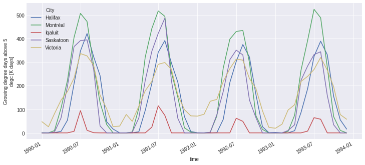

---

marp: true
theme: freud
_class: lead
class: default
footer: Building Open Climate Change Information Services in Python
header: PyCon Lithuania 2024
author: Trevor James Smith
paginate: true
backgroundColor: white
transition: fade
# backgroundImage: url('https://marp.app/assets/hero-background.svg')
size: 16:9
style: |
    footer {
      left: 5%;
      font-size: 20px;
      text-shadow: 0px 0px 10px #fff;
    }
    header {
      right: 10%;
      left: 60%;
      text-align: right;
      font-size: 20px;
      text-shadow: 0px 0px 10px #fff;
    }
    img[alt~="center"] {
      display: block;
      margin: 0 auto;
    }
    .container{
      display: flex;
    }
    .col{
      flex: 1;
    }

---

<style scoped>
  h1 {
    background-color: white;
    border-radius: 30px;
    font-size: 40px;
    left: 5%; 
    opacity: 90%;
    padding: 13px;
    position: absolute;
    right: auto;
  }
  li {
    background-color: white;
    border-radius: 30px;
    bottom: 10.5%;
    color: navy;
    font-size: 25px;
    list-style-type: none;
    opacity: 75%;
    padding: 10px;
    position: absolute;
    right: 5%;
    text-align: right;
  }
  header {
    background: 
      linear-gradient(orange, orange) top,
      linear-gradient(green, green) center,
      linear-gradient(red, red) bottom;
    background-size: 100% 33.33%;
    background-repeat: no-repeat;
    color: white;
    font-size: 30px;
    font-weight: bold;
    left: 35%;
    margin: auto;
    right: 35%;
    text-align: center;
  }
  footer{
    background: lightblue;
    color: black;
    font-size: 24px;
    left: 3%;
  }
  img[alt~="top-right"] {
    background-color: transparent;
    position: absolute;
    right: 3%;
    top: 3%;
    width: 225px;
  }
</style>

<!-- _footer: "**Ouranos**: Innovation cluster and consultation forum enabling Quebec society to better adapt to Climate Change" -->
<!-- _paginate: false -->

# Building Open Climate Change Information Services in Python

<!-- Thanks so much to PyCon Lithuania and the organizers for this fantastic conference so far. Today, I’m talking about how we've been using Python to build our open source offerings to better equip researchers interested in climate science. -->


- **Trevor James Smith**
**PyCon Lithuania**
**April 4th, 2024**
**Vilnius, Lithuania**

---

<style scoped>
    li {font-size: 30px;}
</style>

<!-- _footer: "Photo: Extratropropical Cyclone over Hudson Bay, Canada, August 2016. Credit: NASA Earth Observatory." -->


### Presentation Outline

<!--
This presentation is going to start by providing some context on climate adaptation information services, what my company has built with xclim and how we're actively making these kinds of analyses more accessible worldwide.
-->

<!--

 -->

- Who am I? / What is Ouranos?
- What's our context?
- Climate Services?
- `xclim`: climate operations
- `finch`: `xclim` as a Service
- Climate WPS Frontends
- What's next for us?
- Acknowledgements

---

<style scoped>
  p {font-size: 30px;}
</style>

<!-- _footer: "" -->

<!-- So who am I? I'm a research software developer from Montréal, Québec. My background is in environmental science, specifically GIS and agroclimate modelling. I only really started picking up dev work on the job. I'm also learning Japanese for fun. -->


# Who am I?

**Trevor James Smith**

 [**github.com/Zeitsperre**](https://github.com/Zeitsperre)
 [**Zeit@techhub.social**](https://techhub.social/@zeit)

- Research software developer/packager/maintainer from Montréal, Québec, Canada 🇨🇦
- Studied climate change impacts on wine viticulture 🍇 in Southern Québec 
- Making stuff with Python  for ~6.5 years
- 僕は日本語を勉強しています！ 🇯🇵

---

<style scoped>
  p {
    font-size: 18px;
    text-align: right;
  }
</style>

<!-- _header: "" -->
<!-- _footer: "" -->

<!-- My employer, Ouranos, is a not-for-profit based on Montréeal that works with the Canadian and Quebec governments on climate change adaptation. We were created in response to an extreme storm event that had 1.5 Million people without power for weeks and caused around 5.5 Billion dollars in damage. Our role is to connect government, industry, and academia with many types of climate information so that events like those are less impactful. For the past 8 years or so, we've been moving into software and research platform development. The core development team is small, but we do a lot of collaboration. -->


# What is [Ouranos](https://www.ouranos.ca/en)?

* Non-profit research consortium established in 2003 in Montréal, Québec, Canada
  * Created in response to the [January 1998 North American Ice Storm](https://en.wikipedia.org/wiki/January_1998_North_American_ice_storm) 🌨️
* Climate change adaptation and **climate information services**
* Climate Model Data Producer/Provider

Photo credit: https://www.communitystories.ca/v2/grand-verglas-saint-jean-sur-richelieu_ice-storm/

---

<!-- _header: "" -->
<!-- _footer: "" -->

<!-- Before we get to the Python, it would be good to talk about why climate researchers are becoming software developers;  The fact that human-induced Climate Change is occurring is established fact. The temperature change alone has the potential to really impact a lot of things we depend on. Extreme global weather patterns are just one such side effect. -->


# <!-- fit --> What's the **climate** situation?

<!-- *"Since systematic scientific assessments began in the 1970s, the influence of human activities on the warming of the climate system has evolved from theory to established fact"*

\- IPCC Sixth Assessment Report Technical Summary (IPCC AR6-TS) -->

- Climate Change is having major impacts on Earth's environmental systems
- IPCC: **Global average temperature has increased > 1.1 °C since 1850s**.
  - **> 1.5 °C is considered to be beyond a safe limit**

---

<style scoped>
  footer {
    position: absolute;
    bottom: 3%;
    font-size: 15px;
  }
</style>

<!-- Since we only have one Earth to run experiments on, climate models are one tool to give us physically consistent estimates on what the future _could_ look like. Unfortunately, this means we need more and more storage and computation resources to test more hypotheses. At some point it becomes completely unmanageable and really challenging to determine what we want or even use climate data, so we need intermediaries to help. This field is what we call Climate Services. -->


# <!-- fit --> What's the **climate data** situation?

**Climate data is growing exponentially in size and complexity**
  * New climate models being developed every year
  * More climate simulations being produced every day
  * Higher resolution input **and** output datasets (gridded data)
  * Specialised analyses and more personalized user needs

<!-- "Overpeck, Jonathan T., Gerald A. Meehl, Sandrine Bony, and David R. Easterling. “Climate Data Challenges in the 21st Century.” Science 331, no. 6018 (February 11, 2011): 700–702. https://doi.org/10.1126/science.1197869" -->

---

<!-- _footer: "Infographic from [The Canadian Centre for Climate Services (CCCS)](https://www.canada.ca/en/environment-climate-change/services/climate-change/canadian-centre-climate-services/about.html) " -->

<!--
Climate Services has been a developing field for a few decades now, more so lately with Climate Change. The idea behind a climate service provider is to act as the bridge between researchers in climate and general audiences. You can imagine being a city planner or someone in an industry that can be impacted by climate conditions; if you don't have a background in climate science, where do you even begin? For this we provide information and training to help **make sense of big climate data**. 
-->


# **Climate Services**

## What do they provide?

- Tailoring objectives and information to different user needs
- Providing access to **climate information**
- Building local mitigation/adaptation capacity
- Offering training and support
* Making sense of **Big** ***climate*** **Data**

---

<style scoped>
  li {font-size: 30px;}
</style>

<!--
So what exactly do we provide? Depending on the context, it could be raw historical data to establish trends, or it could be future projections of climate indicators. My background is more agricultural, so we can imagine wanting to know things that would impact our growing season or placing stressing on the crops.

Presenting this information is again dependent on the user; some people like maps, some people want time series, more advanced users might want raw data.

In many general cases, they don't know what they want or need, so we help them figure that out!
-->

# What information do **Climate Services** provide?

<div class="container">

<div class="col">

**Climate Indicators**, e.g.:
  - **Hot Days** (Days with temperature >= 22 deg Celsius);
  - **Beginning / End / Length of the growing season**;
  - **Average seasonal rainfall** (3-Month moving average precipitation);
  - _Many more examples_

</div>

<div class="col">

**Planning Tools**, e.g. :
  - Maps 🗺️
  - Point estimates at geographic locations 📈
  - Gridded values 🌐
  * **Not really sure what they need?** ❓
    **➔ Guidance from experts!**

</div>

</div>

---

<!--
Climate Services have been around for some time, but when I started working on them, there was a lot of terrible things we had to work with...
-->

# **Climate Services** in the 2010s

- `MATLAB`-based in-house libraries (**proprietary** 💰)
  - No external libraries / all in-house
- Issues with data storage/access/processing 😫
  - Small team unable to meet demand 
  - Lack of output data uniformity between researchers ⁉️
  - Lots of bugs 🐛 and human error 🙅
- Data analysis/requests served manually ⏳
- Software testing + data validation? Not really. 😱

---

# Building a **Climate Services** library?

<!--
This couldn't continue, so when we were negotiating with the Canadian Government for a development agreement for a Climate Data website, we were adamant to put some funding into a library to help deal with some of these problems.
-->

---

<!--
At its base, the library needs to be able to calculate climate indicators, obviously, and what comes out should be easily used by users or other tools. Often climate data is averaged across models, so ensemble statistics tools are important, as well as ways of correcting bias from models and ensuring what we get out is physically possible.

Operationally, it needs to handle Terabytes of data from different sources at times. It should be intuitive, and be relatively mistake-proof, and most importantly, we should be able to extend and build upon it, so that people can customize it to their needs.
-->

# What are the requirements?

<div class="container">

<div class="col">

**What does it need to perform?**
  - **Climate Indicators**
    - Units management
    - Metadata management
  - **Ensemble statistics**;
  - **Bias Adjustment**;
  - **Data Quality Assurance Checks**

</div>

<div class="col">

**Implementation goals?**
  - **Operational** : Capable of handling very large ensembles of climate data
  - **Foolproof** : Automatic verification of data and metadata validity by default
  - **Extensible** : Flexibility of use and able to easily provide custom indicators, as needed

</div>

</div>

---

# Is there **Python** in this talk?

- **Yes**
<!--
At this point, you're probably wondering where Python is coming in, and it's on the next slide.
-->

---

<!--
We decided to try our hand at building this all in Python for a number of reasons...

Our goal ultimately was to ensure that we are ensuring that the research comes first and I think we've done that.
-->

# Why build a **Climate Services** library in **Python**? 

* Robust, trusted, and fast scientific Python libraries
* Python's Readability / Reviewability
* Growing demand for climate services/products
  - Provide access to the community so they can help themselves
* *The timing was right*
  - Internal and external demand for common tools
* **Less time writing code, more time spent doing research**

---

<!-- _header: "" -->

<!--
Xclim is what we came up with: The library is build with a few key modules, each handling things like indicators, statistics, bias correction and some other utilities. It manages to strike a nice balance between usability and extensibility, and most importantly, it's fast.
-->


# **Xclim** : Climate Services for Python

 [Ouranosinc/xclim](https://github.com/Ouranosinc/xclim)

- **Asynchonous IO** and **fast**
- **Open Source** design
- **Standards-compliant** metadata
- **Extensible** / modular
- **Operational** 

---

<style scoped>
  h2{
    position: absolute;
    top: 7%;
  }
  li {
    position: absolute;
    bottom: 10%;
    font-size: 35px;
  }
</style>


## How did we build **Xclim**?

<div class="container">

<div class="col">

* **Data Structure**
<!--
We based our data structures on several Open Source scientific Python libraries, namely, Pandas, Numpy and Xarray, ensuring that our code can benefit from the parallelization made possible by Dask. For projects based on xarray, it's customary to put an 'x' in the name, hence 'xclim'.
-->

</div>

<div class="col">

* **Algorithms**
<!--
Xclim was built to be an operational library and as such, we built our algorithms based on more conventional libraries such as scipy for statistics, scikit-learn for bias-adjustment. Numba provides Just-in-time compilation and pandas provides the base API for array and time operations.
-->

</div>

<div class="col">

* **Data and Metdata Conventions**
<!--
Units management and conventions are also key to ensuring that the outputs of operations can be easily used in other applications, and issues such as unit management are handled via libraries dedicated to ensuring that dimensions are always preserved and expected output units are always the same, regardless of inputs.
-->

</div>

</div>

---

<!-- _header: "" -->
<!-- _footer: "" -->

<!-- Here's the simplest example of a climate indicator I can find: We are taking daily values for snow depth and calculating the year average. Everything is well documented using NumPy Docstrings. The unit dimensions are length and we are resampling to a coarser time frequency. The input units could be inches or millimetres and we explicitly check this in the decorator using metadata standards. This is then passed to more checks to make sure everything is valid. -->

# Climate Indicator Example - Average Snow Depth 

```python
@declare_units(snd="[length]")
def snow_depth(
    snd: xarray.DataArray,
    freq: str = "YS",
) -> xarray.DataArray:
    """Mean of daily average snow depth.

    Resample the original daily mean snow depth series by taking the mean over each period.

    Parameters
    ----------
    snd : xarray.DataArray
        Mean daily snow depth.
    freq : str
        Resampling frequency.

    Returns
    -------
    xarray.DataArray, [same units as snd]
        The mean daily snow depth at the given time frequency
    """
    return snd.resample(time=freq).mean(dim="time").assign_attrs(units=snd.units)
```

---

<!-- _header: "" -->

<!-- 
The `indicators` module is what we suggest for users and it handles...

But for those who want to circumvent all these checks, we expose the core `indices` module, which you can use as a basis to build your own indicators or you can use it directly if you trust yourself.
-->


## **Xclim** algorithm design

### Two ways of calculating indicators

* `indicators` (**End-User API**)
  - Metadata standards checks
  - Data quality checks
  - Time frequency checks
  - Missing data-compliance
  - Calendar-compliance
* `indice` (**Core API**)
  - For users that don't care for the standards and quality checks

---

<!--
We often get data from many sources and the units can sometimes be wildly different, like Celsius and Fahrenheit for temperature, or sometimes precipitation is total vs a rate. Also, in some fields, equations can be metric or imperical, so getting units right was key.

Here we have an example for calculating monthly growing degree days, with different units for the source data and thresholds. 
-->

## What does **Xclim** do? ➔ Units Management

```python
import xclim
from clisops.core import subset

# Data is in Kelvin, threshold is in Celsius, and other combinations

# Extract a single point location for the example
ds_pt = subset.subset_gridpoint(ds, lon=-73, lat=44)

# Calculate indicators with different units

# Kelvin and Celsius
out1 = xclim.atmos.growing_degree_days(tas=ds_pt.tas, thresh="5 degC", freq="MS")

# Fahrenheit and Celsius
out2 = xclim.atmos.growing_degree_days(tas=ds_pt.tas_F, thresh="5 degC", freq="MS")

# Fahrenheit and Kelvin
out3 = xclim.atmos.growing_degree_days(tas=ds_pt.tas_F, thresh="278.15 K", freq="MS")
```

---

<style scoped>
  img {
    position: absolute;
    box-shadow: 0px 0px 10px rgba(0, 0, 0, 0.5);
    left: 8%;
    size: 90%;
  }
</style>

<!--
Running this block we can see that regardless of the units used, they're always going to be cosnsistent, which is great for mixing and matching data from different sources.
-->

## What does **Xclim** do? ➔ Units Management


```python
import xclim
from clisops.core import subset

# Data is in Kelvin, threshold is in Celsius, and other combinations

# Extract a single point location for the example
ds_pt = subset.subset_gridpoint(ds, lon=-73, lat=44)

# Calculate indicators with different units

# Kelvin and Celsius
out1 = xclim.atmos.growing_degree_days(tas=ds_pt.tas, thresh="5 degC", freq="MS")

# Fahrenheit and Celsius
out2 = xclim.atmos.growing_degree_days(tas=ds_pt.tas_F, thresh="5 degC", freq="MS")

# Fahrenheit and Kelvin
out3 = xclim.atmos.growing_degree_days(tas=ds_pt.tas_F, thresh="278.15 K", freq="MS")
```

---

## What does **Xclim** do? ➔ Missing Data and Metadata Locales

<!--
Since Quebec is a French-speaking region of Canada, `xclim` also has the capability to dynamically translate metadata depending on the locale. We actually built a pretty comprehensive engine for doing this. It can support any language, really, so Lithuania would be possible if you're interested in implementing it.

Here we have a calculation for days with temperature below 0 Celsius. I've also added a check for missing data, so any years that are missing more than 5% of values are dropped to strengthen the statistics. -->

```python
import xarray as xr
import xclim

ds = xr.open_dataset("my_dataset.nc")

with xclim.set_options(
    # Drop timesteps with more than 5% of missing data
    set_missing="pct", missing_options=dict(pct={"tolerance": 0.05}),

    metadata_locales=["fr"] # Add French language metadata
):
    # Calculate Annual Frost Days (days with min temperature < 0 °C) 
    FD = xclim.atmos.frost_days(ds.tas, freq="YS")
```

---

<style scoped>
  img {
    box-shadow: 0px 0px 10px rgba(0, 0, 0, 0.5);
    left: 15%;
    position: absolute;
    top: 20%;
    width: 70%;
  }
</style>

<!--
Looking at the metadata of the object, we can see in the history that the information about how we calld this operation shows the missing data threshold, the call signature and operation, the version etc.

Below that we also have the dynamically generated metadata for the Indicator, complete with the customized thresholds, for both French and English.
-->

## What does **Xclim** do? ➔ Missing Data and Metadata Locales

```python
import xarray as xr
import xclim

ds = xr.open_dataset("my_dataset.nc")

with xclim.set_options(
    # Drop timesteps with more than 5% of missing data
    set_missing="pct", missing_options=dict(pct={"tolerance": 0.05}),

    metadata_locales=["fr"] # Add French language metadata
):
    # Calculate Annual Frost Days (days with min temperature < 0 °C) 
    FD = aclim.atmos.frost_days(ds.tas, freq="YS")
```


---

<style scoped>
  h2 {
    position: absolute;
    top: 10%;
  }
  p {
    bottom: 8%;
    position: absolute;
  }
</style>


## What does **Xclim** do ➔ Climate Ensemble Mean Analysis

**Average temperature from the years 1991-2020 baseline across 14 IPCC climate models at Montréal, Québec** (*extreme warming scenario: SSP3-7.0*)

<!--
Here's an example of what we can calculate with xclim.

On the left is the average annual temperature for Quebec for 30-year periods calculated from 14 different climate model projections.  

While the right shows us the change in average temperature based on years 1990-2020 across those 14 models until the end of the century.

I just want to reassure you that for dramatic purposes, thse values are showing off the more extreme climate change scenario. There's still time to get our act together on the climate!
-->

---

<style scoped>
  h1 {
    position: absolute;
    top: 5%;
  }
  li {
    font-size: 24px;
  }
</style>

<!-- _header: "" -->
<!-- _footer: "" -->

<!--
All models are inherently wrong, and climate models are not special, so adjusting them so that their distributions of values match what we should expect is very important if we want to use them for real world scenarios is critical. I'm not really a stats person so I just wanted to briefly show what that looks like on the right here.
-->


## What Does **Xclim** do? ➔ Bias Adjustment

- Adjusts model bias from projected data using a `train` / `adjust` approach
- Several implementations available :
  - Quantile Mapping
  - Principal Components Analysis
  - Multivariate (`MBCn`)
- Plugin support for statistics package **SBCK** 
  - `dOTC`, `CDFt`, others

---

<!-- _footer: "" -->

<!--
Building this tool has also involved a lot of upstream contributions as well, addressing bugs or adding features to better work with climate data. Much of the changes center around calendar systems, standard units, and statistics.

I'll also mention that my team regularly contributes to the maintenance of a few libraries in the domain.
-->

## Upstream contributions from **Xclim**

- Non-standard calendar (`cftime`) support in `xarray.groupby`
- Quantile methods in `xarray.groupby`
- Non-standard calendar conversion migrated from `xclim` to `xarray`
- Climate and Forecasting (CF) unit definitions inspired from `MetPy`
  - Inspiring work in `cf-xarray`
- Weighted variance, standard deviations and quantiles in `xarray` (for ensemble statistics)
-  Faster **NaN**-aware quantiles in `numpy` 
-  Initial polyfit function in `xarray`

* Not to forget mentioning work done by the team in `xESMF`, `intake-esm`, `cf-xarray`, `xncml`, and others for `xclim`-related tools

---

<!-- This is all great if you have the data, resources, and technical training to run your analyses, but what if... -->

### That's great and all, but what if...

* There's just too much data that we need to crunch :
  - The data could be spread across servers globally
  - Local computing power is not powerful enough for the analyses

* The user knows programming but not Python :
  - A biologist who uses `R` or a different program for their work
  - An engineer who just needs a range of estimates for future rainfall

* The user just wants to see some custom maps :
  - Agronomist who is curious about average growing conditions in 10 years?

---

<!-- _footer: "" -->

<!--
For those with the Python knowledge, you can run your scripts on a web platform, connected directly to the data.

This is a figure showing some of the ways we've made either our tools or data or information more accessible to all kinds of users. Technical users can use either the tools directly, or run them on our Jupyter-based research platform we call PAVICS; People who just want data outputs could use programmable dashboards we've made; or they can just grab data values from a map or pre-computed indicators.
-->


---

<!--
Another platform out there is The Microsoft Planetary Computer which hosts a bunch of climate data and has had xclim available for a few years now, with examples of how to use it.

But accessibility is constantly a concern for climate services, so if you aren't familiar with Python, there are still ways of making use of it.
-->


# **Xclim** on Computation Platforms

## Microsoft Planetary Computer

* [Computing Climate Indicators with xclim](https://planetarycomputer.microsoft.com/dataset/cil-gdpcir-cc0#Climate-indicators)

---

# Enhancing Accessibility : Web Services

* **WMS**
  * **Google Maps**
* **WFS**
* **WCS**
* **WPS** : ***Web Processing Service***
  - Running geospatial analyses over the internet

<!--
Another approach to solving the problem is to turn it into a service that can be deployed on a server and fetched via a web-based standard.

By show of hands, who knows the following web services...?

... The last one, Web Processing Service is what we decided to implement so that more user types could serve themselves.
-->

---

<!-- _header: "" -->

<!--
So we decided to move forward with building a Web Service in partnership with a project based in Germany called Bird-house, the idea being to be able to run analyses using Web Standards built in Python.

...Bird-house likes to name their projects after Birds, so to be clever, we landed on "Finch" to make reference to environmental adaptations that Charles Darwin talked about when he wrote about finches in the Galapagos Islands.
-->


# Finch 

## **Xclim** as a **Web Service**

####  [github.com/Bird-house/Finch](https://github.com/bird-house/finch)

- Remote analysis of climate indicators
- Implements **Web Processing Service** (**WPS**) standard
  - Built in Python (**PyWPS**)

* _Bird-house likes to name their projects after birds_  

---

<style scoped>
  h1 {
    position: absolute;
    top: 10%;
  }
  h3 {
    position: absolute;
    bottom: 10%;
  }
</style>

<!--  -->

# **Finch** Climate Analysis Web Service


### Dynamically-generated indicators from `xclim`

---

<!-- _header: "" -->
<!-- _footer: "" -->

<!-- -->

## Using the **Finch** Web Service from Python (with `birdy`)

```python
from birdy import WPSClient

wps = WPSClient(finch_url)

# Using the OPeNDAP protocol
remote_dataset = "www.exampledata.lt/climate.ncml"

# The indicator call looks a lot like the one from `xclim` but
# passing a url instead of an `xarray` object.
response = wps.growing_degree_days(
    remote_dataset,
    thresh='10 degC',
    freq='MS',
    variable='tas'
)

# Returned as a streaming `xarray` data object
out = response.get(asobj=True).output_netcdf

out.growing_degree_days.plot(hue='location')
```

[Bird-house/birdy](https://github.com/Bird-house/birdy) -> PyWPS Helper Library

---

<style scoped>
  img {
    box-shadow: 0 0 10px rgba(0, 0, 0, 0.5);
    left: 10%;
    position: absolute;
    top: 15%;
    width: 80%;
  }
</style>  

<!-- _header: "" -->
<!-- _footer: "" -->

<!-- -->

## Using the **Finch** Web Service from Python (`birdy`) 

```python
from birdy import WPSClient

wps = WPSClient(finch_url)

# Using the OPeNDAP protocol
remote_dataset = "www.exampledata.lt/climate.ncml"

# The indicator call looks a lot like the one from `xclim` but
# passing a url instead of an `xarray` object.
response = wps.growing_degree_days(
    remote_dataset,
    thresh='10 degC',
    freq='MS',
    variable='tas'
)

# Returned as a streaming `xarray` data object
out = response.get(asobj=True).output_netcdf

out.growing_degree_days.plot(hue='location')
```

[Bird-house/birdy](https://github.com/Bird-house/birdy) -> PyWPS Helper Library

---

<style scoped>
  h1 {
    background-color: white;
    border-radius: 30px;
    font-size: 40px;
    left: 5%;
    opacity: 80%;
    padding: 16px;
    position: absolute;
    right: auto;
    top: 35%;
  }
  h2 {
    background-color: white;
    border-radius: 30px;
    font-size: 40px;
    left: 10%;
    opacity: 80%;
    padding: 16px;
    position: absolute;
    right: auto;
    top: 50%;
  }
</style>

<!-- _header: "" -->
<!-- _footer: "" -->
<!-- _paginate: false -->

<!-- -->

# Making it accessible ➔ Web Frontends

## [ClimateData.ca](https://climatedata.ca)


---

<!-- _header: "" -->
<!-- _footer: "" -->
<!-- _paginate: false -->

<!--  -->


---

<!-- -->

# Modern-day **Climate Science/Services**

- **Open Source Python** libraries (`numpy`, `sklearn`, `xarray`, etc.)
- **Multithreading** and streaming data formats (e.g. `ZARR`)
- **Common tools** built in-house and **shared widely** (`xclim`, `finch`)
- **Docker**-deployed Web-Service-based infrastructure 
- Testing (`pytest`), CI/CD, and data validation workflows
- **Peer-Reviewed Software** (**JOSS**)

---

<style scoped>
  li {
    font-size: 20px;
  }
  h1 {
    background: 
      linear-gradient(orange, orange) top,
      linear-gradient(green, green) center,
      linear-gradient(red, red) bottom;
    background-size: 100% 33.33%;
    background-repeat: no-repeat;
    color: white;
    font-size: 75px;
    height: 12%;
    text-align: center;
    top: 100%;
  }
</style>

<!-- -->

<div class=container>

<div class=col>

# Thanks!

### Colleagues and Collaborators

- Pascal Bourgault
- David Huard
- Travis Logan
- Abel Aoun
- Juliette Lavoie
- Éric Dupuis
- Gabriel Rondeau-Genesse
- Carsten Ehbrecht
- Long Vu
- Sarah Gammon
- David Caron
 **and many more contributors!**

</div>

<div class="col">

# Ačiū!

**Have a great rest of PyCon Lithuania!**

## **[github.com/Ouranosinc/xclim](https://github.com/Ouranosinc/xclim)**
[](https://doi.org/10.21105/joss.05415)
[](https://doi.org/10.5281/zenodo.10710942)

## **[github.com/Bird-house/finch](https://github.com/bird-house/finch)**
[](https://doi.org/10.5281/zenodo.10870939)

</div>

</div>
